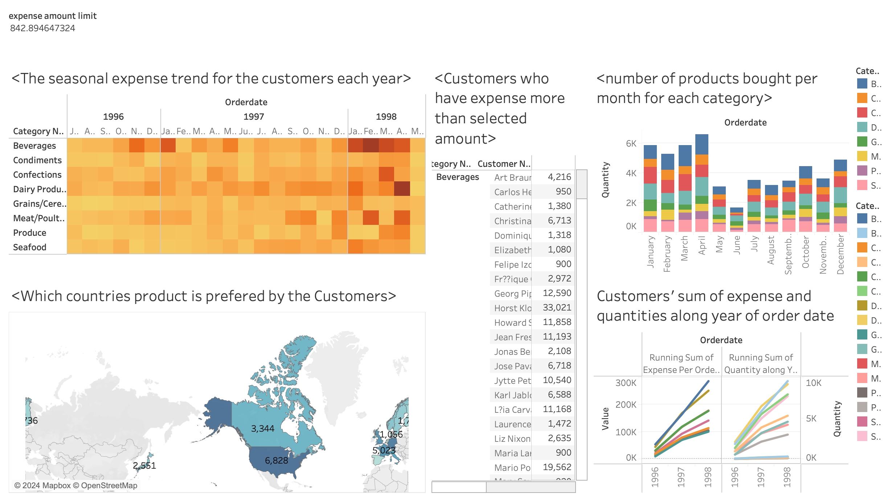

## Objectives

This project helps to 

1.  Identify customer segmentation based on spending behavior

2.  Identify revenue-driving products and seasonal analysis 

3.  Allocate resource efficiently and managing inventory

## Instruction

1. To check SQL data warehouse result: Execute `CreateDatabase.sql`,`DataWarehouse.sql`,`Queries.sql` in sequence

2. To check Data Visualization through Tableau Public: https://public.tableau.com/app/profile/skyler.ge3169/viz/finalproject_17058938681500/Customeranalysis
 
