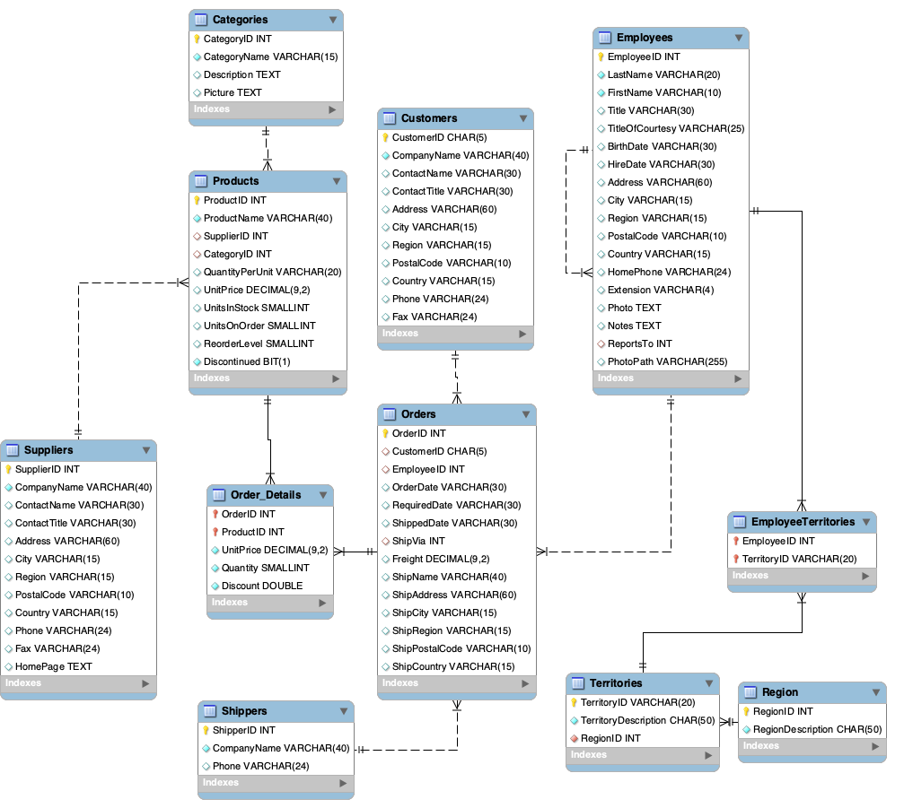
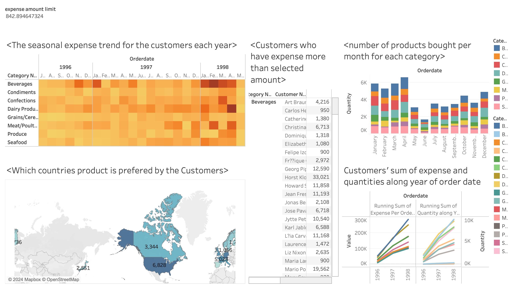

# Customer Behavior Analysis on Sales Data

## Objectives
1.  💡 Identify customer segmentation based on spending behavior

2.  📈 Identify revenue-driving products and seasonal analysis

3.  🌎 Allocate resource efficiently and managing inventory

## Instruction
---
1. Create Data Warehouse: Execute `CreateDatabase.sql`,`DataWarehouse.sql`
---



```sql
use cis467_final_project;
CREATE OR REPLACE VIEW Customerdw AS
SELECT
c.ContactName as CustomerName, STR_TO_DATE(o.OrderDate, '%m/%d/%Y')as
Orderdate, c.City as customer_city,c.Country as customer_country,
ProductName, quantity, (UnitPrice*quantity)as expense_per_order, CategoryName,
s.CompanyName, s.city as supplier_city, s.country as supplier_country
FROM Orders o
JOIN Customers c
ON o.CustomerID = c.CustomerID
JOIN(SELECT o.OrderID, o.ProductID, ProductName, p.CategoryID, o.UnitPrice,
supplierID,o.quantity
FROM Order_Details o
JOIN Products p
ON o.ProductID = p.ProductID) AS Product_query
ON o.OrderID = Product_query.OrderID
JOIN Categories ca
ON ca.CategoryID = Product_query.CategoryID
JOIN suppliers s
ON s.supplierID =Product_query.supplierID
```
---
2. Insights on Customer consumption behavior: Execute `Queries.sql`
---
```sql
-- Customer 
-- Which customers have spent the most money on orders?
SELECT CustomerName, SUM(expense_per_order) AS total_expense
FROM Customerdw
GROUP BY CustomerName
ORDER BY total_expense DESC;

-- What is the average order value for each customer?
SELECT CustomerName, AVG(expense_per_order) AS average_order_value
FROM Customerdw
GROUP BY CustomerName
ORDER BY average_order_value DESC;

-- Which customers place the most orders?
SELECT CustomerName, COUNT(DISTINCT Orderdate) AS number_of_orders_placed
FROM Customerdw
GROUP BY CustomerName
ORDER BY number_of_orders_placed DESC;

-- How has customer spending evolved over time?
SELECT Orderdate, SUM(expense_per_order) AS total_expense
FROM Customerdw
GROUP BY Orderdate
ORDER BY Orderdate;

-- Which customers have consistently high spending over time?
SELECT CustomerName, COUNT(DISTINCT Orderdate) AS active_months, SUM(expense_per_order) AS total_expense
FROM Customerdw
GROUP BY CustomerName
ORDER BY total_expense DESC;

-- Which cities have the highest spending customers?
SELECT customer_city, SUM(expense_per_order) AS total_expense_by_customer_city
FROM Customerdw
GROUP BY customer_city
ORDER BY total_expense_by_customer_city DESC;

-- Products
-- Which products generate the highest revenue for the company?
SELECT ProductName, SUM(expense_per_order) AS total_revenue
FROM Customerdw
GROUP BY ProductName
ORDER BY total_revenue DESC;

-- Which products are the most popular overall?
SELECT ProductName, COUNT(*) AS total_orders
FROM Customerdw
GROUP BY ProductName
ORDER BY total_orders DESC;

-- Which category of products are ordered in the largest quantities?
SELECT CategoryName, AVG(quantity) AS average_quantity_per_order
FROM Customerdw
GROUP BY CategoryName
ORDER BY average_quantity_per_order DESC;

-- How does the seasonal variation impact order frequency and expenses?
SELECT MONTH(Orderdate) AS month, COUNT(*) AS total_orders, SUM(expense_per_order) AS total_expense
FROM Customerdw
GROUP BY month
ORDER BY month;
```
---
3. Data Visualization using Tableau:
   https://public.tableau.com/app/profile/skyler.ge3169/viz/finalproject_17058938681500/Customeranalysis
---
 
