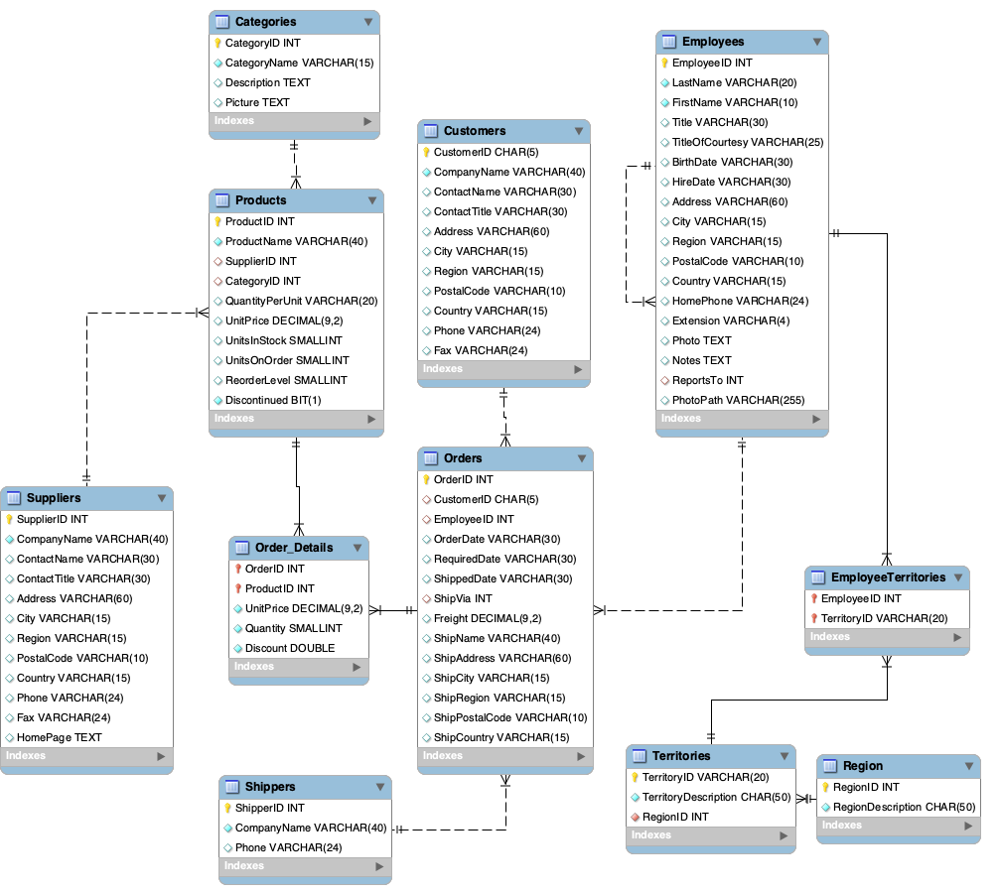

## Objectives

This project helps to 

1.  Identify customer segmentation based on spending behavior

2.  Identify revenue-driving products and seasonal analysis 

3.  Allocate resource efficiently and managing inventory

## Instruction

1. SQL data warehouse result: Execute `CreateDatabase.sql`,`DataWarehouse.sql`



```sql
use cis467_final_project;
CREATE OR REPLACE VIEW Customerdw AS
SELECT
c.ContactName as CustomerName, STR_TO_DATE(o.OrderDate, '%m/%d/%Y')as
Orderdate, c.City as customer_city,c.Country as customer_country,
ProductName, quantity, (UnitPrice*quantity)as expense_per_order, CategoryName,
s.CompanyName, s.city as supplier_city, s.country as supplier_country
FROM Orders o
JOIN Customers c
ON o.CustomerID = c.CustomerID
JOIN(SELECT o.OrderID, o.ProductID, ProductName, p.CategoryID, o.UnitPrice,
supplierID,o.quantity
FROM Order_Details o
JOIN Products p
ON o.ProductID = p.ProductID) AS Product_query
ON o.OrderID = Product_query.OrderID
JOIN Categories ca
ON ca.CategoryID = Product_query.CategoryID
JOIN suppliers s
ON s.supplierID =Product_query.supplierID
```

2.Customer consumption behavior insights: Execute `Queries.sql`

3.To check Data Visualization through Tableau Public: https://public.tableau.com/app/profile/skyler.ge3169/viz/finalproject_17058938681500/Customeranalysis
 
